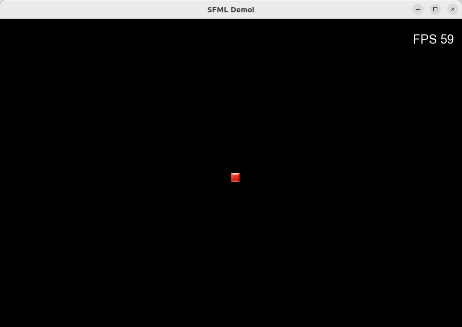

# sfml-base-template
C++/SFML Base Template for 2D Games

This repository contains a base template for the rapid development of 2D games and applications using C++ and the SFML library. The project is structured to be a clean and easily extensible starting point for future demos or small games.

Features:

Language: C++
Multimedia Library: SFML
Build System: CMake, for simple, cross-platform compilation.
Core Structure: A Game class that encapsulates the main game loop, event handling, and basic rendering logic.
Asset Management: Includes fonts and images directories for easy asset organization.
"wasd" movement

